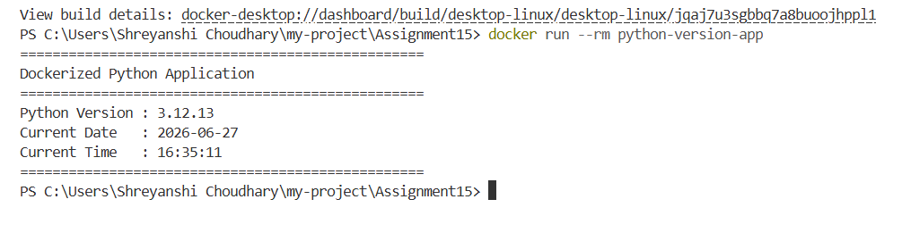

# Dockerized Python Application

This project demonstrates how to run a Python application inside a Docker container.

## Project Structure

```
docker-python-app/
│
├── app.py
├── Dockerfile
├── requirements.txt
└── README.md
```

## Prerequisites

- Docker installed
- Git installed

## Build Docker Image

```bash
docker build -t python-version-app .
```

## Run Docker Container

```bash
docker run --rm python-version-app
```

## Expected Output

```
==================================================
Dockerized Python Application
==================================================
Python Version : 3.12.13
Current Date   : 2026-06-27
Current Time   : 16:35:11
==================================================
```

## Screenshot

Add a screenshot of the output and save it as

```
screenshot.png
```

Then include it below.

```markdown

```